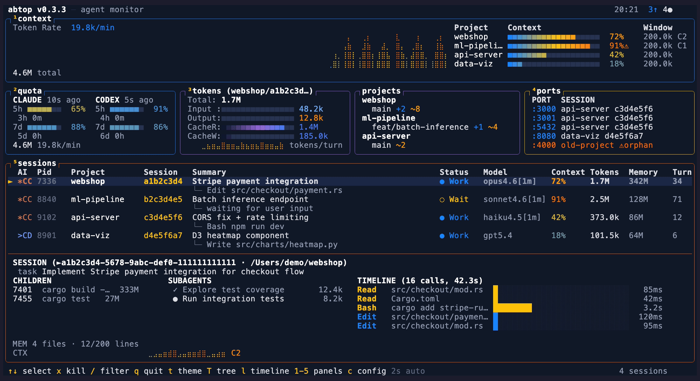

# abtop

**Like htop, but for your AI coding agents.**

See every Claude Code, Codex CLI, and pi session at a glance — token usage, context window %, rate limits, child processes, open ports, and more.



## Why

- Running 3+ agents across projects? See them all in one screen.
- Hitting rate limits? Watch your quota in real-time.
- Agent spawned a server and forgot to kill it? Orphan port detection.
- Context window filling up? Per-session % bars with warnings.

All read-only. No API keys. No auth.

## Install

### macOS / Linux

```bash
curl --proto '=https' --tlsv1.2 -LsSf https://github.com/graykode/abtop/releases/latest/download/abtop-installer.sh | sh
```

### Cargo

```bash
cargo install abtop
```

### Other

Pre-built binaries for all platforms are available on the [GitHub Releases](https://github.com/graykode/abtop/releases) page.

## Usage

```bash
abtop                    # Launch TUI
abtop --once             # Print snapshot and exit
abtop --setup            # Install rate limit collection hook
abtop --theme dracula    # Launch with a specific theme
```

Recommended terminal size: **120x40** or larger. Minimum 80x24 — panels hide gracefully when small.

### Windows

abtop requires Unix tools (`ps`, `lsof`) and is not supported natively on Windows. Use [WSL](https://learn.microsoft.com/en-us/windows/wsl/install) instead:

```bash
wsl --install
# Inside WSL:
curl --proto '=https' --tlsv1.2 -LsSf https://github.com/graykode/abtop/releases/latest/download/abtop-installer.sh | sh
abtop
```

### tmux

abtop works standalone, but running inside tmux unlocks session jumping — press `Enter` to switch directly to the pane running that agent.

```bash
tmux new -s work
# pane 0: abtop
# pane 1: claude (project A)
# pane 2: claude (project B)
# → Enter on a session in abtop jumps to its pane
```

## Supported Agents

| Feature           | Claude Code | Codex CLI |  pi  |
| ----------------- | :---------: | :-------: | :--: |
| Session Discovery |     ✅      |    ✅     |  ✅  |
| Token Tracking    |     ✅      |    ✅     |  ✅  |
| Context Window %  |     ✅      |    ✅     |  ✅  |
| Status Detection  |     ✅      |    ✅     |  ✅  |
| Current Task      |     ✅      |    ✅     |  ✅  |
| Rate Limit        |     ✅      |    ✅     |  —   |
| Git Status        |     ✅      |    ✅     |  ✅  |
| Children / Ports  |     ✅      |    ✅     |  ✅  |
| Subagents         |     ✅      |    ❌     |  ❌  |
| Memory Status     |     ✅      |    ❌     |  ❌  |

`pi` = [`@mariozechner/pi-coding-agent`](https://github.com/badlogic/pi-mono/tree/main/packages/coding-agent).
Rate limit is `—` because pi is provider-agnostic — users bring their own API keys, so there's no account-level quota to surface.
If a pi process has started but hasn't persisted its first assistant response yet, abtop shows a temporary pending session row with zero tokens until the real JSONL session file appears.

## Themes

10 built-in themes, including 4 colorblind-friendly options (`high-contrast`, `protanopia`, `deuteranopia`, `tritanopia`). Press `t` to cycle at runtime, or launch with `--theme <name>`. Your choice is saved to `~/.config/abtop/config.toml`.

| btop (default) | dracula | catppuccin |
|:-:|:-:|:-:|
|  |  |  |

| tokyo-night | gruvbox | nord |
|:-:|:-:|:-:|
|  |  |  |

Colorblind-friendly themes:

| high-contrast | protanopia |
|:-:|:-:|
|  |  |

| deuteranopia | tritanopia |
|:-:|:-:|
|  |  |

Theme support contributed by [@tbouquet](https://github.com/tbouquet).

## Key Bindings

| Key                | Action                               |
| ------------------ | ------------------------------------ |
| `↑`/`↓` or `k`/`j` | Select session                       |
| `Enter`            | Jump to session terminal (tmux only) |
| `x`                | Kill selected session                |
| `X`                | Kill all orphan ports                |
| `t`                | Cycle theme                          |
| `1`–`5`            | Toggle panel visibility              |
| `Esc`              | Open/close config page               |
| `q`                | Quit                                 |
| `r`                | Force refresh                        |

## Privacy

abtop reads local files only. No API keys, no auth. Tool names and file paths are shown in the UI, but file contents and prompt text are never displayed. Session summaries are generated via `claude --print`, which makes its own API call — this is the only indirect network usage.

## License

MIT
