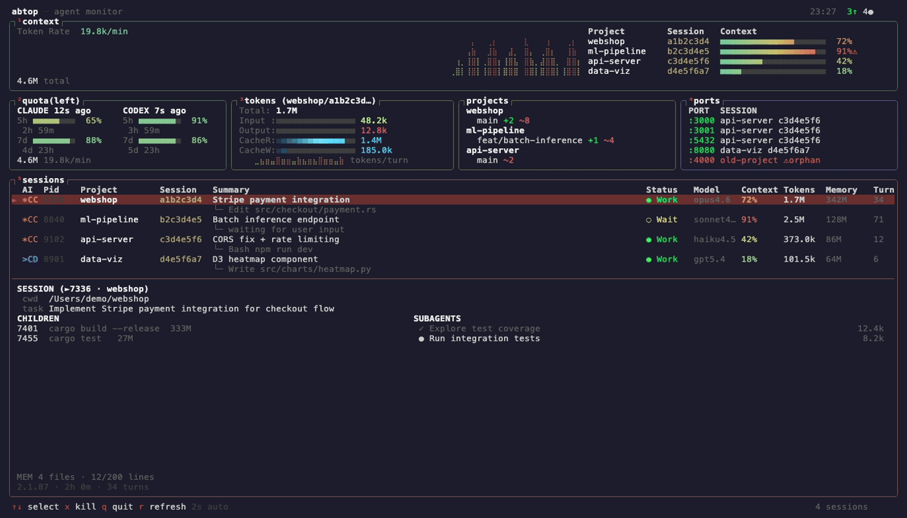

# abtop

A monitor for AI coding agents.

Inspired by [htop](https://github.com/htop-dev/htop) and [btop](https://github.com/aristocratos/btop).



Currently supports **Claude Code** and **Codex CLI**.

## Install

### macOS / Linux

```bash
curl --proto '=https' --tlsv1.2 -LsSf https://github.com/graykode/abtop/releases/latest/download/abtop-installer.sh | sh
```

### Windows

```powershell
powershell -ExecutionPolicy ByPass -c "irm https://github.com/graykode/abtop/releases/latest/download/abtop-installer.ps1 | iex"
```

### Cargo

```bash
cargo install abtop
```

### Other

Pre-built binaries for all platforms are available on the [GitHub Releases](https://github.com/graykode/abtop/releases) page.

## Usage

```bash
abtop          # Launch TUI
abtop --once   # Print snapshot and exit (debug mode)
```

## Supported Agents

| Feature | Claude Code | Codex CLI |
|---------|:-----------:|:---------:|
| Session Discovery | ✅ | ✅ |
| Transcript Parsing | ✅ | ✅ |
| Token Tracking | ✅ | ✅ |
| Context Window % | ✅ | ✅ |
| Status Detection | ✅ | ✅ |
| Current Task | ✅ | ✅ |
| Subagents | ✅ | ❌ |
| Memory Status | ✅ | ❌ |
| Rate Limit | ✅ | ✅ |
| Git Status | ✅ | ✅ |
| Children / Ports | ✅ | ✅ |
| Done Detection | ✅ | ✅ |
| Cache Tokens | ✅ | ✅ |
| Initial Prompt | ❌ | ✅ |

## Key Bindings

| Key | Action |
|-----|--------|
| `↑`/`↓` or `k`/`j` | Select session |
| `Enter` | Jump to session terminal (tmux only) |
| `Tab` | Cycle focus between panels |
| `1`–`4` | Toggle panel visibility |
| `q` | Quit |
| `r` | Force refresh |

## Tech Stack

- **Rust** (2021 edition)
- **ratatui** + **crossterm** for TUI
- **tokio** for async runtime
- **serde** + **serde_json** for JSONL parsing

## Privacy

abtop reads local files only. No network calls, no API keys, no auth. Tool names and file paths are shown in the UI, but file contents and prompt text are never displayed.

## License

MIT
